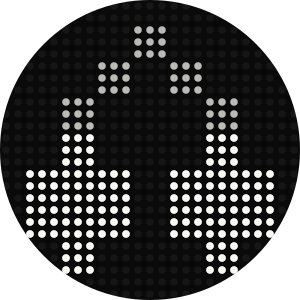

<p align="center">
  
</p>

# GlyphSlot

Glyph Toy « machine à sous » pour la Glyph Matrix du Nothing Phone (3).
Appui long sur le Glyph Button → spin de 5 s avec effet ressort, arrêts en
cascade et effets de victoire (pulse ×3, chorégraphie jackpot 777).

**[▶ Préview interactive](https://aero-md.github.io/glyphslot/)** — le
prototype web ([glyph-slot-preview.jsx](glyph-slot-preview.jsx)) jouable dans
le navigateur : mêmes constantes, même cinématique que le toy.

Specs détaillées : [SPECS.md](SPECS.md) · annexe : [SPECS-ANNEXE.md](SPECS-ANNEXE.md) ·
plan : [PLAN.md](PLAN.md).

| Tirage perdant | Victoire ×3 | Jackpot 777 |
|:---:|:---:|:---:|
|  |  |  |

*Animations SVG générées depuis la cinématique réelle du moteur
([`preview/`](preview/)) — mêmes constantes, mêmes easings que le toy.*

## Build

- Android Studio (ou `./gradlew assembleDebug`), JDK 17, minSdk 34.
- Sans Android Studio : installer les
  [commandline-tools](https://developer.android.com/studio#command-line-tools-only)
  (`sdkmanager "platform-tools" "platforms;android-35" "build-tools;35.0.0"`,
  puis `sdkmanager --licenses`) et indiquer le SDK via un `local.properties`
  à la racine du projet avec `sdk.dir=C:\\chemin\\vers\\le\\sdk`
  (ou la variable d'environnement `ANDROID_HOME`). `local.properties` est
  propre à la machine — jamais versionné (.gitignore).
- `GlyphMatrixSDK.aar` est **téléchargé automatiquement au premier build**
  (tâche `downloadGlyphSdk`, hook sur `preBuild`) dans `app/libs/` — non versionné.

## Test sur appareil

1. Installer sur un Phone (3) : `./gradlew installDebug`.
2. Activer le toy : **Settings → Glyph Interface → Glyph Toys → Glyph Slot**.
3. **Clé API : plus nécessaire sur Android 16.** La restriction est levée pour
   les apps ciblant Android 16+ (`targetSdk = 36`) — vérifié sur Phone (3) /
   Nothing OS Android 16, le toy fonctionne sans clé ni mode debug. Sur un
   OS plus ancien, le mode debug reste requis (clé `NothingKey=test`, 48 h) :
   `adb shell settings put global nt_glyph_interface_debug_enable 1`
   Si la matrice reste noire ou que le toy crashe :
   `adb logcat -b crash -d` pour la stack trace.
4. Pour itérer sans retourner le téléphone : la préview Compose 25×25 utilise
   exactement le même moteur et le même renderer que le toy (boutons Tirage /
   Forcer ×3 / Forcer 777). L'icône launcher n'existe qu'en **debug** ; en
   release l'app n'a pas de raccourci (le toy vit dans Glyph Interface).
   Lancement direct si besoin :
   `adb shell am start -n dev.aero.glyphslot/.MainActivity`

## Architecture

```
engine/   SlotEngine.kt, Reels.kt        logique pure, testable JUnit, sans SDK
render/   MatrixRenderer.kt, Sprites.kt,
          Effects.kt                     IntArray(625) par frame, sans SDK
toy/      SlotToyService.kt,
          GlyphMatrixService.kt          seul module dépendant du GlyphMatrixSDK
MainActivity.kt                          préview Compose 25×25
```

Le temps est injecté dans `SlotEngine` (secondes monotones) : la machine à
états et la cinématique des rouleaux se testent en JVM pure
(`./gradlew test`).

## Interaction

| Event | Action |
|-------|--------|
| Appui court | Système : cycle entre les toys |
| Appui long (« change ») | Lancer le spin (ignoré si spin en cours) |
| `onUnbind` | Stop boucle + extinction matrice |

## Release

APK signé sur la [page des releases](https://github.com/aero-md/glyphslot/releases/latest).

Publier une nouvelle version : bump `versionName`/`versionCode` dans
`app/build.gradle.kts`, puis pousser un **tag annoté** `vX.Y.Z` — le message du
tag devient la release note :

```
git tag -a v1.0.0 -m "Notes de release…"
git push origin v1.0.0
```

Le workflow [release.yml](.github/workflows/release.yml) build, signe
(secrets `KEYSTORE_BASE64` / `KEYSTORE_PASSWORD` / `KEY_ALIAS` / `KEY_PASSWORD`)
et attache `GlyphSlot-X.Y.Z.apk` à la release.

## Licence

[MIT](LICENSE)
